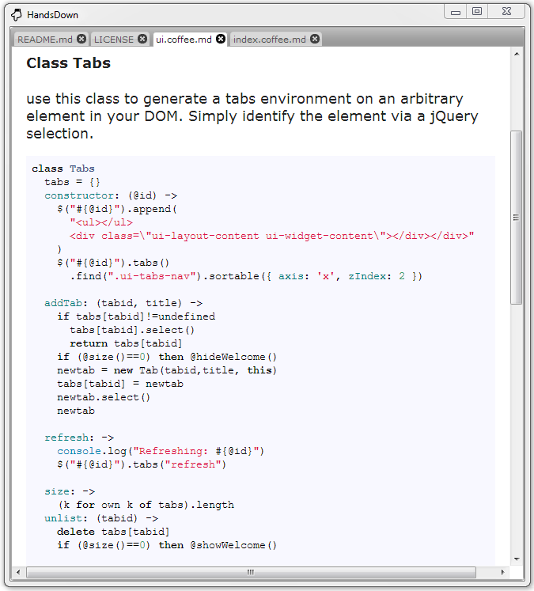

HandsDown
==========

_Hands down, this is the simplest viewer for Markdown (and other) files you have ever seen._

The purpose of this projetc is twofold. On the one hand, __HandsDown__ is a nice and handy
Markdown viewer that can be used to view and check your Markdown files, for example before
pushing them to Github.

On the other hand, this project demonstrates
1. **literate programming** with Coffeescript,
2. **Coffeescript** as a language for Node.js,
3. **node-webkit** as basis for desktop applications,
4. Github as **host for literate programs**, and
5. platform-specific **distribution of node-webkit applications** using Git branches.

### Download

Last in first out: How to distribute a node-webkit application using Github. Of course you can just clone this project using git, using the clone URL on the right hand side. If you have [node-webkit installed](https://github.com/rogerwang/node-webkit), simply run it by the command "nodewebkit FOLDER" where FOLDER is the folder of this README. 

If you want to have node-webkit packaged together with HandsDown, you can checkout the distribution branch matching your environment. Currently, there are [dist-win](https://github.com/kaiec/HandsDown/tree/dist-win), [dist-linux32](https://github.com/kaiec/HandsDown/tree/dist-linux32), and [dist-linux64](https://github.com/kaiec/HandsDown/tree/dist-linux64).

If you just want to download HandsDown with node-webkit packaged, use the following links:

- Windows: [Download ZIP](https://github.com/kaiec/HandsDown/archive/dist-win.zip)
- Linux 32 bit: [Download ZIP](https://github.com/kaiec/HandsDown/archive/dist-linux32.zip)
- Linux 64 bit: [Download ZIP](https://github.com/kaiec/HandsDown/archive/dist-linux64.zip)

Simply unpack HandsDown to a folder of your choice and run HandsDown.exe, HandsDown, or HandsDown64, respectively.

### License

HandsDown is released under the [MIT license](LICENSE).